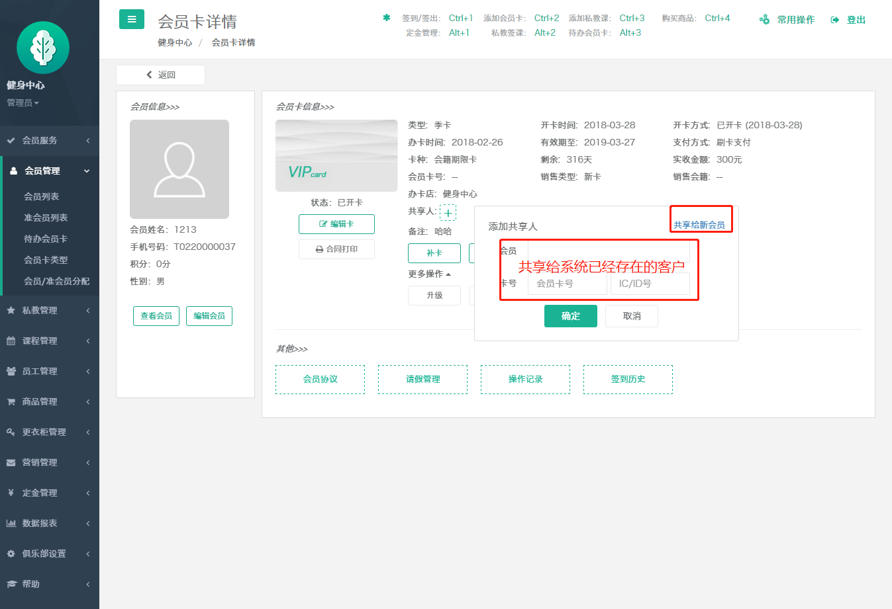

# 共享人添加

首先，若想给会员卡添加共享人，则相应的卡种必须要允许多人使用 ，可以 在“会员管理》》会员卡类型 ”编辑会员卡种信息

多人使用勾选是，跳出弹框“是否将已办理的会员卡更新为多人使用”是的话，点是，否的话点否，输入可给几个人使用，保存即可

在会员列表里找到要共享会员卡的会员，进入会员卡详情，点击共享人右侧添加标识

（1）若是老会员输入老会员相关信息即可

（2）若共享给新会员点击共享给新会员

