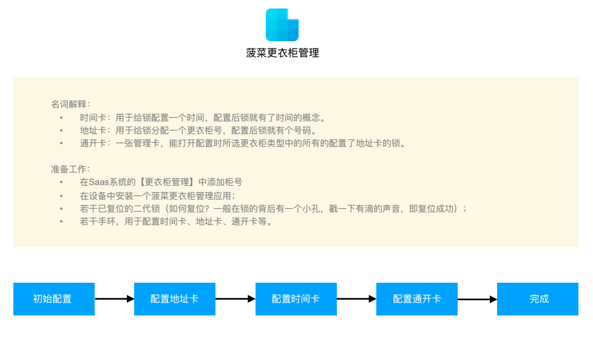
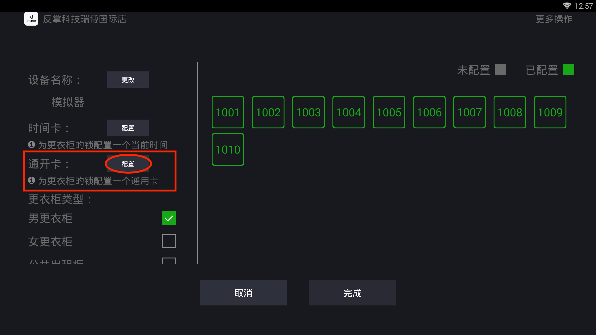

# 如何配置二代锁

如何配置二代锁

**一、初始设置**                                                                                                                                                             注：目前仅支持管理员和店长账号登录 

**1、登录后根据提示进行初始设置：选择门店、设置设备名称、选择更衣柜类型等。**

**2、记住设备名称，并告知菠菜工作人员进行软件升级。**

**3、点击右上角人像图标进入登录界面，输入账户即密码进入配置页面， 升级后的配置页面如下：**

下面正式进入二代锁的配置，以下操作我们都以选中【男更衣柜】后对男更衣柜进行配置为例，其他更衣柜的配置需要选中某个更衣柜类型后换一批手环进行同样的配置操作即可。

**二、配置地址卡**                                                                                                                                                           `注：最好准备较多手环，若手环有限请仔细阅读注意事项。`

 1、点击一个柜号，如“1001”，根据提示拿一个手环放在读卡器上，提示成功后，将该手环放到已复位的锁上，锁会有滴一声，即配置成功； 2、配置成功后，该锁就被认为是男更衣柜类型中“1001”更衣柜的锁。 **【注意】** • 每一个锁都需要配置地址卡，根据锁所在的柜号一一对应，且每次只能配置一把锁。 • 若手环数量有限，可以仅使用一个手环进行配置，但是需要反复操作，手环只能记住（被写入）一个号码。如在设备上写入01，去01锁上滴一下；在设备上写入1002，去1002锁上滴一下……。不能先在设备上写入1001、写入1002……，然后去1001锁、1002锁……滴一下。

**四、配置通开卡**                                                                                                                                                                    `注：此处需要准备另外一个新的手环。`

1、点击通开卡旁的“配置”，根据提示拿一个新手环放在读卡器上，提示成功后，即配置成功 

2、配置成功后，该锁就会获得一个男更衣柜的开锁权限，可以打开男更衣柜里所有配置了地址卡的锁。 【注意】 通开卡请妥善管理。

**五、完成**

将所有更衣柜类型中的锁按照上述操作配置，并点击完成 ，则配置成功。

