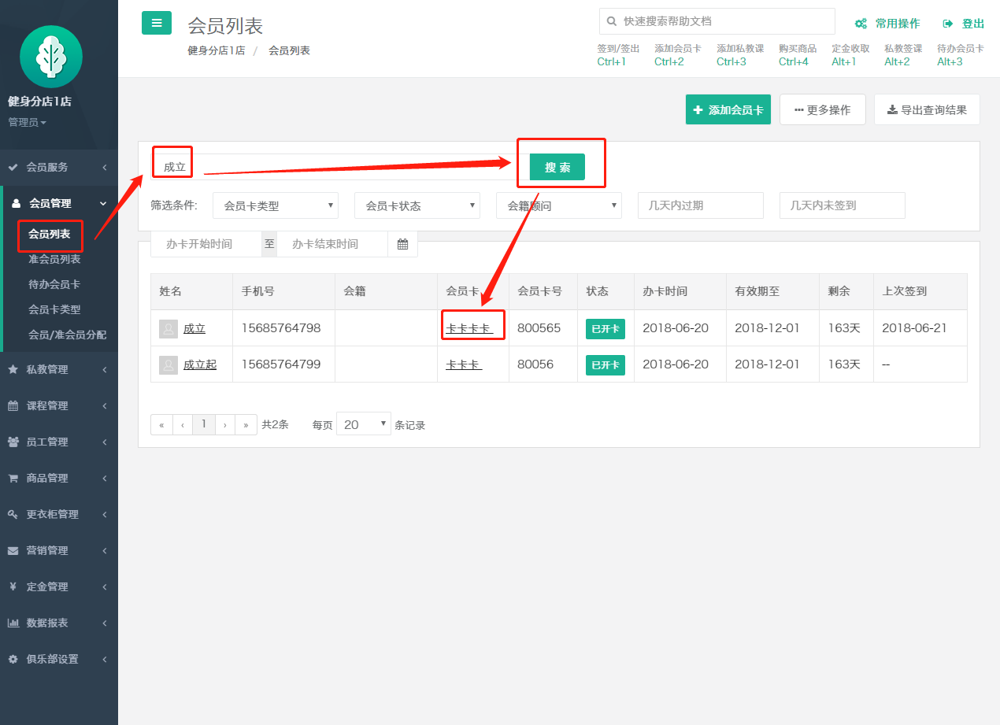
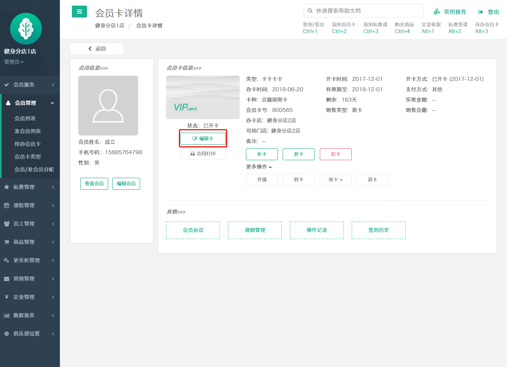
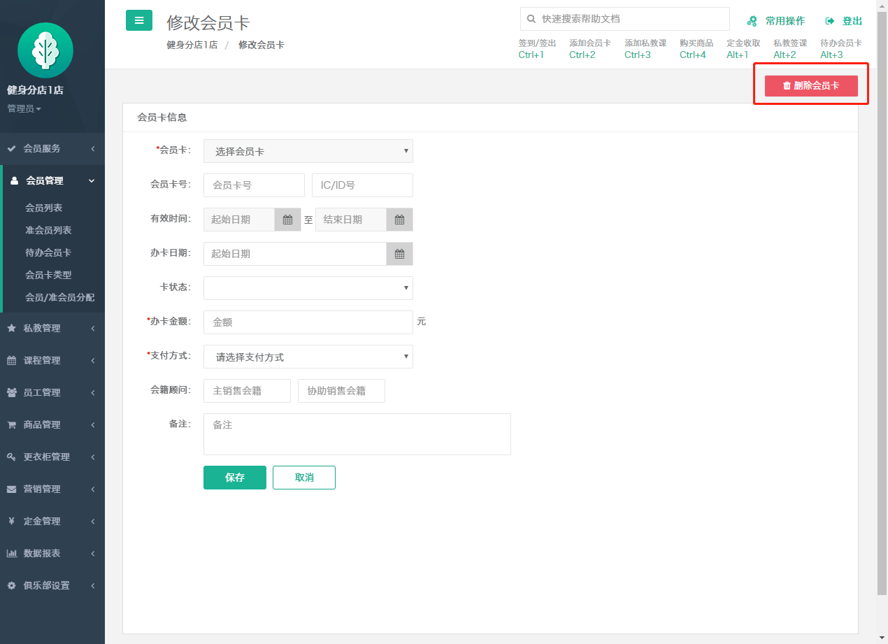
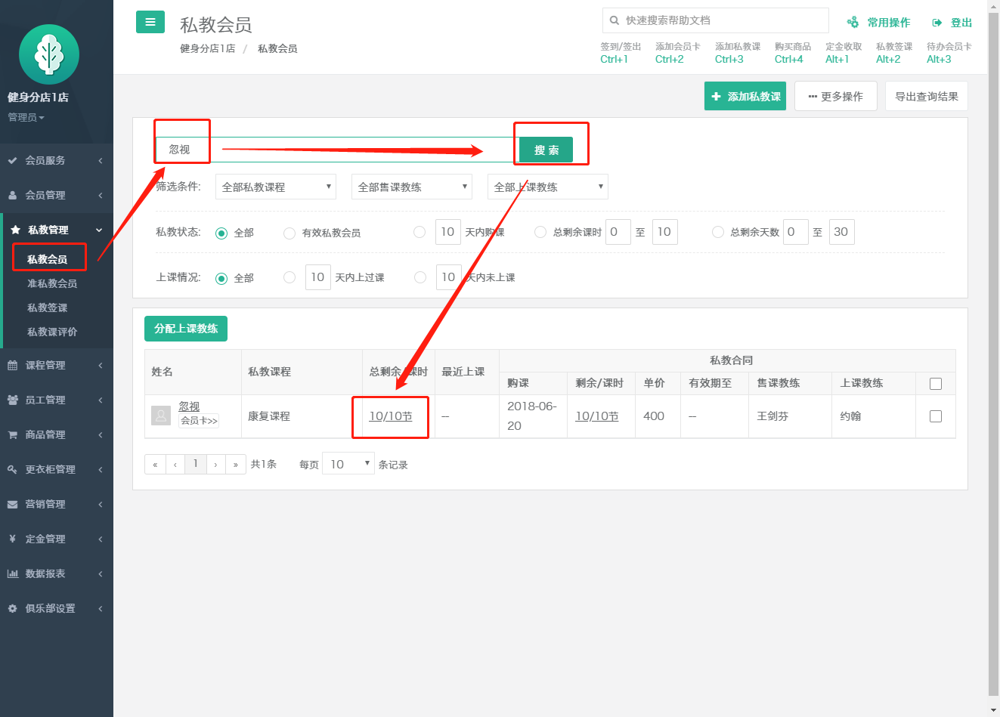
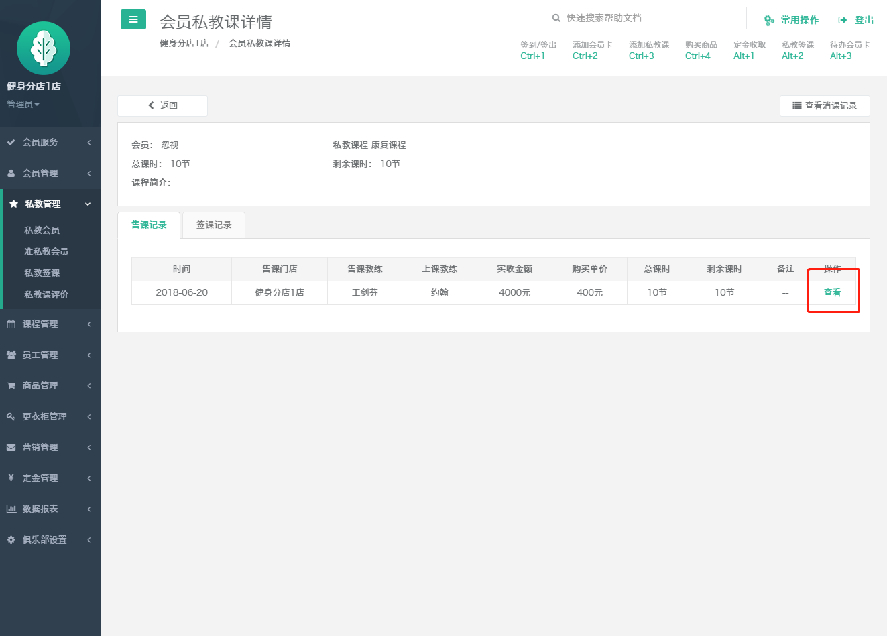
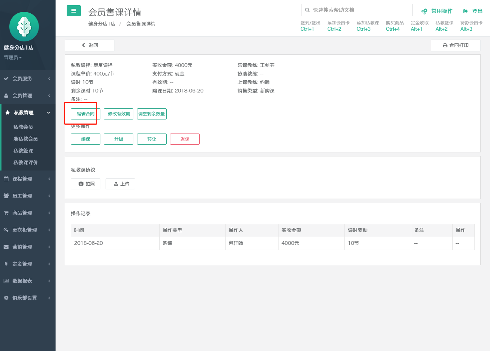
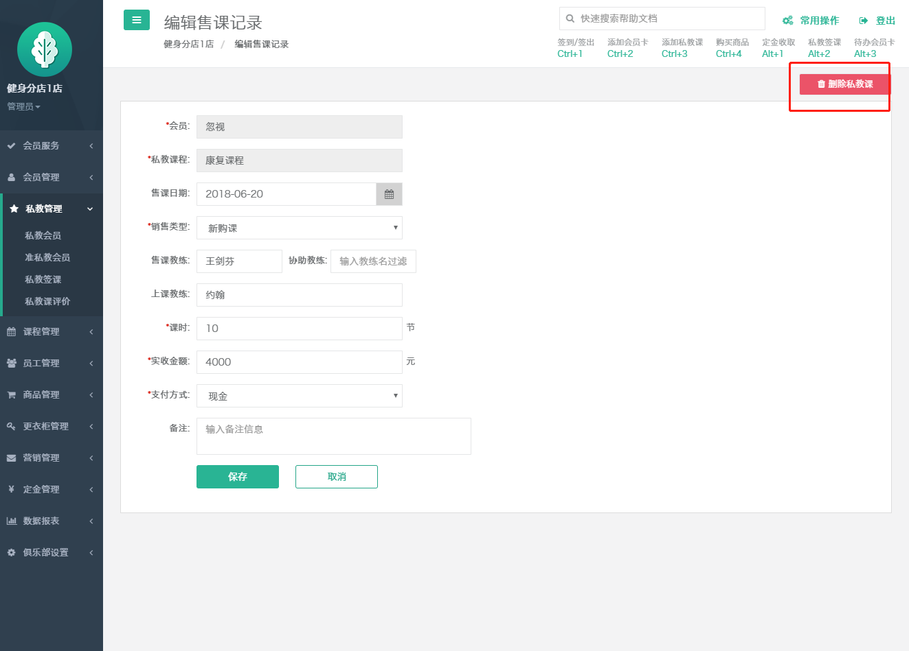

# 如何删除会员卡，私教课

在会员列表找到这个会员，然后点击这个会员的会员卡，进入会员卡详情界面，编辑卡，在编辑卡的界面，点击右上角的删除会员卡，进行会员卡的删除

私教课的删除

私教课的删除，只有未上课的私教合同才可以进行私教课的删除

在私教会员类别找到这个会员，点进去需要删除的私教的合同，查看私教课的售课详情，点击查看进入合同的详情界面，编辑合同，点击右上角的删除私教课进行私教合同的删除。

